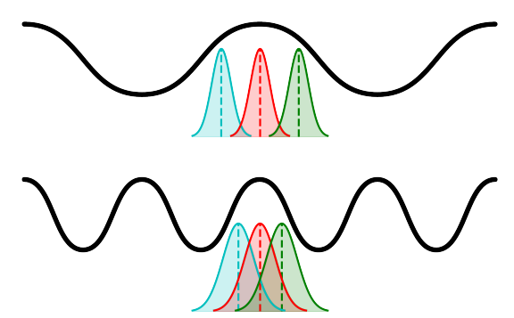

# Phase-Coding-in-LIF
This repository contains theoretical and empirical analyses of spike-phase distributions and the information rate capacity of LIF neurons encoding inputs in phase and with membrane potential fluctuations driven by white noise. Follow up on the paper:[Amil, A. F., Albesa-Gonzalez, A., & Verschure, P. F. (2022). Theta oscillations optimize information rate in the hippocampus. bioRxiv, 2022-12](https://doi.org/10.1101/2022.12.08.519523)

